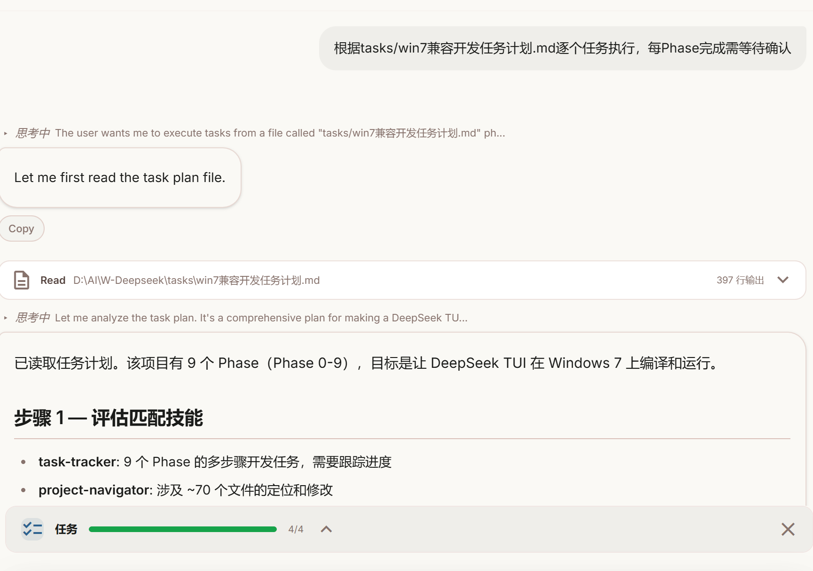

根据你提供的图片内容，我来解析这个“任务执行确认”的AI交互场景，并给出一个通用的 **AI任务执行会话框功能设计方案**。



## 📷 图片内容解析

从会话片段可以看出，这是一个**AI与人类协作执行多阶段开发任务**的场景：

| 元素 | 内容 |
|------|------|
| **用户意图** | 要求AI按计划文件`win7兼容开发任务计划.md`）逐个Phase执行，每个Phase完成后等待用户确认 |
| **AI动作** | 先读取任务计划文件，分析后发现共有9个Phase（Phase 0-9），涉及约70个文件 |
| **交互模式** | 用户 → AI下达指令 → AI读取文件 → AI分析 → AI等待确认 → 继续下一步 |
| **任务类型** | 开发任务自动化（让DeepSeek TUI在Windows 7上编译运行） |
| **关键约束** | Phase完成后必须等待用户确认才能继续 |

---

## 🧠 AI任务执行会话框功能设计方案

基于上述解析，设计一个通用的、适合开发任务的AI会话框功能模块。

---

### 1. 核心设计理念

> **“用户可控的渐进式自动化”**

- AI主动执行，但每一步都需要用户确认

- 进度透明，用户可以随时介入调整

- 支持长任务、多Phase、多文件的复杂场景

---

### 2. 功能架构

```

┌─────────────────────────────────────────────────────────┐

│ AI 任务执行会话框 │

├─────────────────────────────────────────────────────────┤

│ ┌───────────────────────────────────────────────────┐ │

│ │ 📋 任务计划栏 │ │

│ │ Phase 0: 环境准备 \[✅ 完成\] │ │

│ │ Phase 1: 依赖分析 \[🔄 进行中\] │ │

│ │ Phase 2: 代码修改 \[⏳ 等待中\] │ │

│ │ ... │ │

│ │ Phase 9: 最终验证 \[⏳ 等待中\] │ │

│ └───────────────────────────────────────────────────┘ │

│ │

│ ┌───────────────────────────────────────────────────┐ │

│ │ 💬 对话区 │ │

│ │ ┌─────────────────────────────────────────────┐ │ │

│ │ │ \[用户\] 按计划文件逐个Phase执行，每Phase完成需等待确认 │ │ │

│ │ └─────────────────────────────────────────────┘ │ │

│ │ ┌─────────────────────────────────────────────┐ │ │

│ │ │ \[AI\] 已读取任务计划。该项目有9个Phase... │ │ │

│ │ │ 是否开始Phase 0？ │ │ │

│ │ └─────────────────────────────────────────────┘ │ │

│ └───────────────────────────────────────────────────┘ │

│ │

│ ┌───────────────────────────────────────────────────┐ │

│ │ 🎮 控制栏 │ │

│ │ \[▶ 开始\] \[⏸ 暂停\] \[⏭ 跳过当前\] \[🔄 重试\] \[✅ 确认\] │ │

│ └───────────────────────────────────────────────────┘ │

│ │

│ ┌───────────────────────────────────────────────────┐ │

│ │ 📊 状态栏 │ │

│ │ 当前Phase: 1/9 │ 文件修改: 12/68 │ 预估剩余: 3min │ │

│ └───────────────────────────────────────────────────┘ │

└─────────────────────────────────────────────────────────┘

```

---

### 3. 详细功能模块

#### 3.1 任务计划解析模块

**功能**：AI自动读取并解析用户提供的任务计划文件

| 能力 | 说明 |
| :--- | :--- |
| 文件格式支持 | `.md.txt.json.yaml` 等 |
| 自动识别Phase | 识别 `Phase 0步骤1Task 1` 等标记 |
| 提取任务元信息 | 任务名称、依赖关系、预估时间、涉及文件数 |
| 状态持久化 | 记录已完成的Phase，支持中断后恢复 |

#### 3.2 渐进式执行模块

**功能**：AI自动执行当前Phase，完成后主动等待确认

```

执行流程：

用户: "按计划文件执行，每Phase完成等待确认"

↓

AI: 读取计划 → 识别Phase列表 → 标记Phase 0为"进行中"

↓

AI: 执行Phase 0的具体操作（如修改文件、运行命令）

↓

AI: Phase 0完成 → 输出执行结果摘要 → 等待用户确认

↓

用户: "确认" / "继续" / "没问题"

↓

AI: 标记Phase 0为"完成" → 开始Phase 1

↓

... 循环直到所有Phase完成

```

#### 3.3 用户确认机制

**确认方式**（支持多种语义）：

| 用户输入 | AI理解 |
| :--- | :--- |
| `确认` / `继续` / `OK` / `好的` / `通过` | ✅ 确认通过，继续下一Phase |
| `重试` / `重新执行` / `再来一次` | 🔄 重新执行当前Phase |
| `跳过` / `忽略这个` | ⏭️ 跳过当前Phase，标记为”已跳过” |
| `暂停` / `停止` | ⏸️ 暂停执行，等待后续指令 |
| `修改xxx` / `调整xxx` | ✏️ 用户介入修改，AI重新执行当前Phase |

#### 3.4 进度可视化模块

**实时展示信息**：

- Phase进度条`[██████░░░░] 6/9 Phase已完成`

- 文件修改计数`已修改 34/68 个文件`

- 当前操作详情`正在分析 src/main.rs 中的Windows API调用...`

- 预估剩余时间`约 2 分钟`

#### 3.5 异常处理模块

| 场景 | AI行为 |
| :--- | :--- |
| 执行失败（编译错误） | 暂停执行，输出错误详情，询问用户”是否重试/跳过/手动介入” |
| 依赖MSRV过高（如之前遇到的sha2问题） | 自动尝试降级版本，降级失败后报告用户等待指令 |
| 文件找不到 | 输出缺失文件路径，询问用户是否创建/忽略 |
| 用户长时间不确认 | 保留当前状态，支持下次会话加载恢复 |

#### 3.6 执行日志模块

**记录内容**：

- 每个Phase的开始/结束时间

- 每个操作的输入/输出

- 错误堆栈和警告信息

- 支持导出为 `.log` 或 `.json` 格式

---

### 4. 技术实现建议

#### 4.1 状态数据结构

```typescript

interface TaskExecutionState {

planFile: string; // 计划文件路径

phases: Phase\[\]; // Phase列表

currentPhaseIndex: number; // 当前执行到第几个Phase

status: "idle" | "running" | "waiting\_confirm" | "paused" | "completed";

history: ExecutionRecord\[\]; // 执行记录

}

interface Phase {

id: string; // "phase\_0"

name: string; // "环境准备"

status: "pending" | "running" | "waiting\_confirm" | "completed" | "skipped" | "failed";

result?: string; // 执行结果摘要

filesModified?: string\[\]; // 修改的文件列表

}

```

#### 4.2 提示词设计（让AI遵循该模式）

```

你正在执行一个多阶段开发任务。任务计划存储在文件 {plan\_path} 中。

执行规则：

1\. 先读取完整计划文件，解析所有Phase

2\. 从第一个未完成的Phase开始执行

3\. 每完成一个Phase的所有操作后，输出执行摘要

4\. 主动询问用户“是否继续下一Phase？”

5\. 只有收到用户的肯定回复（确认/继续/OK/是/好）后才继续

6\. 如果用户说“重试”，重新执行当前Phase

7\. 如果用户说“跳过”，标记当前Phase为已跳过，进入下一Phase

8\. 任何时候遇到错误，停止执行并询问用户

输出格式：

【Phase X/Y 完成】

- 操作摘要：...

- 修改文件：...

- 状态：等待确认

是否继续？

```

---

### 5. 与“Win7兼容开发”场景的对应

| 你的场景需求 | 设计中的对应功能 |
| :--- | :--- |
| 按计划文件执行 | 任务计划解析模块 |
| 逐个Phase执行 | 渐进式执行模块 |
| 每Phase完成后等待确认 | 用户确认机制 |
| 涉及约70个文件修改 | 进度可视化 + 文件修改计数 |
| Windows 7 + Rust 1.75约束 | 异常处理中的MSRV降级逻辑 |
| 可能需要多轮调试 | 执行日志 + 状态持久化 |

---

## ✅ 总结

这个方案的核心是**让AI成为开发者的“可控副驾驶”**——AI负责执行具体操作，但决策权和确认权始终在人类手中。适用于：

- 多阶段开发任务

- 遗留系统兼容性改造

- 需要谨慎确认的代码迁移

- 批量文件修改场景

如果你需要，我可以进一步提供该会话框的**前端组件代码**（React/Vue）或**AI提示词模板**。